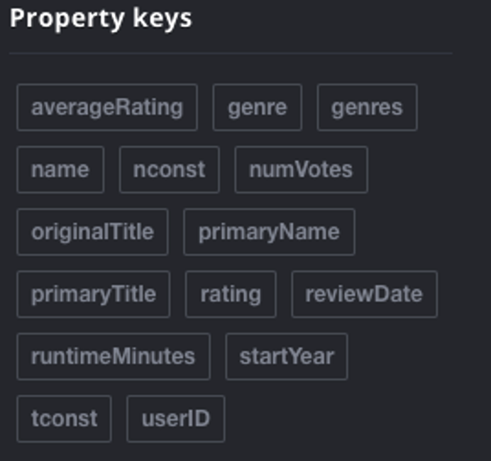
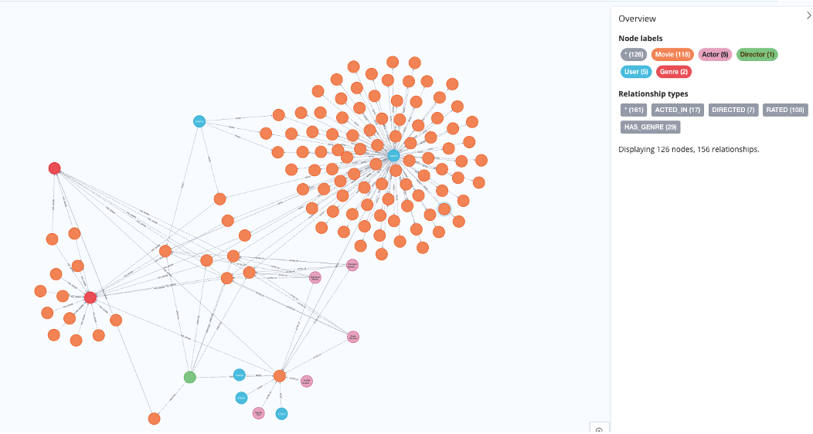
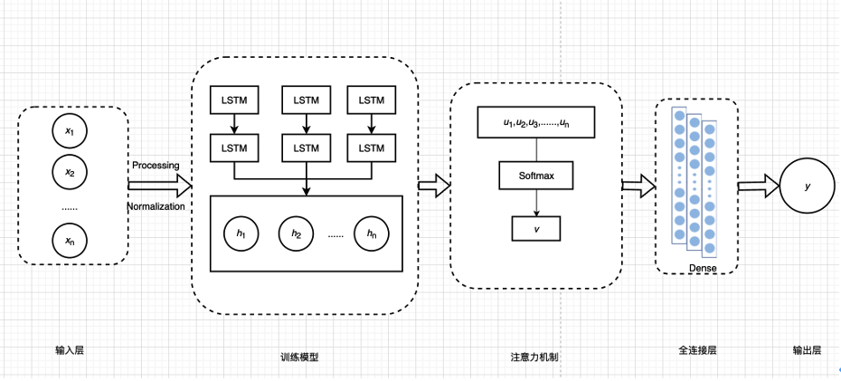
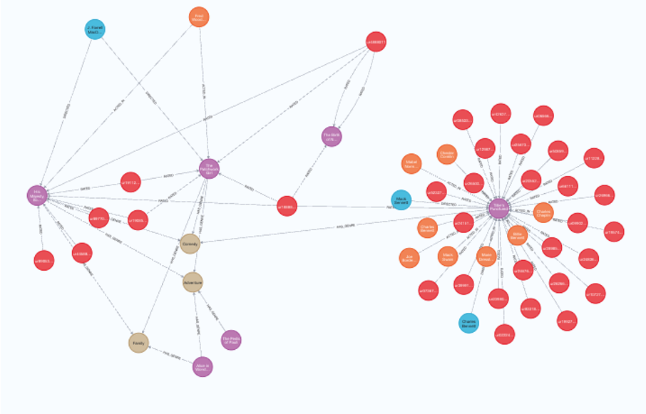
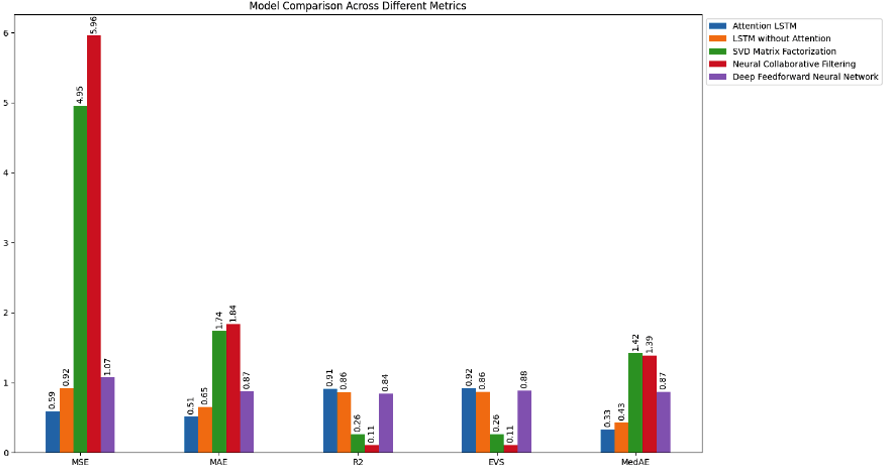

# Research on Personalised Movie Recommendation Systems Based on Knowledge Graphs and LSTM Model

## Abstract
With the rapid advancement of internet and information technologies, users face the challenge of information overload, giving rise to personalised recommendation systems. This study proposes an innovative approach, integrating knowledge graphs, Long Short-Term Memory (LSTM) networks, and attention mechanisms to construct an accurate and interpretable personalised movie recommendation system.
The research initially constructs a movie domain knowledge graph based on the IMDb dataset, encompassing entities such as films, actors, directors, and genres. Subsequently, an attention-based LSTM model is designed and implemented to capture the dynamic changes in user interests. This model enhances recommendation accuracy, personalization, and interpretability by fusing knowledge graph embeddings with user historical behaviour sequences. To evaluate model performance, extensive experiments were conducted, comparing the proposed model with multiple benchmarks, including traditional SVD matrix factorization, standard LSTM, Neural Collaborative Filtering (NCF), and deep feedforward neural networks. Experimental results demonstrate that, compared to the standard LSTM model, the proposed model reduced Mean Squared Error (MSE) by 36%, increased the coefficient of determination (R²) by 5.8%, decreased Mean Absolute Error (MAE) by 21.5%, and improved the Explained Variance Score (EVS) by 7%. Furthermore, the model's interpretability was significantly enhanced through visualization using the Neo4j graph database and analysis of attention weights. This study also specifically addressed the cold-start problem in recommendation systems, achieving significant progress in handling new users and new movies through the introduction of knowledge graphs. Concurrently, the research explored potential challenges in practical applications of the model, including computational complexity and data privacy issues.
In summary, this study provides novel ideas and methodologies for the development of personalised movie recommendation systems, exploring the integration of knowledge graphs and deep learning models, while also offering feasible technical solutions for practical applications. Future research will further investigate the fusion of multimodal data, the application of transfer learning in cross-domain recommendations, and strategies for optimising and deploying the model on large-scale datasets.
```
Keywords: Personalised Recommendation System; Knowledge Graph; LSTM Model; Attention Mechanism; Interpretability
```

## The completed property list


## The knowledge graph of complex relationships is constructed


## LSTM model structure based on attention mechanism


## Neo4j relational graph database builds user-movie-feature relationship network


## Performance comparison bar chart of each model, including MSE, MAE, and R2 indicators


## Usage

Before starting the Neo4j service, you need to create the `neo4j_data` directory in the project root directory to store the Neo4j database files and logs.
Run the following command in the project root:

```bash
mkdir -p neo4j_data/data neo4j_data/logs neo4j_data/plugins neo4j_data/import
```

To start the Neo4j service using Docker Compose, execute the following command:
```bash
make run
```